```{r setup, include=FALSE}
knitr::opts_chunk$set(echo = FALSE)
```

## Overview of `base::browser()`
- This is a brief overview of `base::browser()` and how to use it for debugging in R.
- `browser()` is default function found in R.
- Useful tool to "hack into" R functions (that you or other people wrote)

## Typical day in lab
```{r initialize, echo = TRUE}
head(iris)
```
- Task: Researcher's ruler was off by 5 inches. Let's adjust it!

## Oops {.build}
```{r oops, echo = TRUE}
# Loop through each column and add 5
df <- iris
for(j in 1:ncol(df)){
  df[,j] <- df[,j] + 5
}
```

```{r oops_reason, echo = TRUE}
unlist(lapply(iris, class))
```
- Forgot that `Species` column is not numeric!

## Quick and dirty solution {.build}
```{r oops_solution, echo = TRUE}
# Loop through each column EXCEPT the last one and add 5
df <- iris
for(j in 1:(ncol(df)-1)){
  df[,j] <- df[,j] + 5
}
head(df)
```

## We got lucky
- Not all error messages are obvious
- Not all bugs come from such easy code
- Not all bugs are this easy to fix

## More likely scenario {.build}
```{r hard_code, eval = FALSE, echo = TRUE}
foo_1 <- function(x) { ... }
foo_2 <- function(x) { ... }
# Code that produces some error
for(j in 1:ncol(df)){
  foo_1(df[,j])
  foo_2(df[,j])
}
```

```{r hard_code_2, eval = FALSE, echo = TRUE}
foos <- function(x) {
  foo_1(foo_2(x))
}
super_foo <- function(df) {
  # Code that produces some error
  for(j in 1:ncol(df)){
    foos(df[,j])
  }
}
super_foo(iris)
```

## `browser()` to the rescue
```{r browser_case, eval = FALSE, echo = TRUE}
for(j in 1:ncol(df)){
  browser()  <--------
  foo_1(df[,j])
  foo_2(df[,j])
}
```

## Example
```{r browser_example, eval = FALSE, echo = TRUE}
add_five <- function(x) {x + 5}
df <- iris
outside_var <- "I'm outside the loop"
for(j in 1:ncol(df)){
  print(paste("start of the iteration:", j)) 
  inside_var <- "I'm inside the loop"
  browser()
  df[,j] <- add_five(df[,j])
  print(paste("end of the interation:", j)) 
}
```

## Trigger `browser()` mode
- Run your code
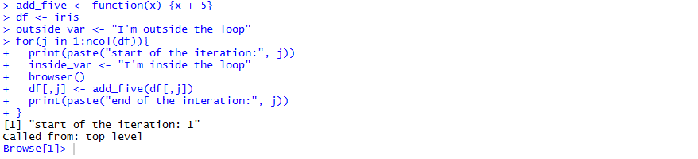
- Run expressions within `browser()` mode
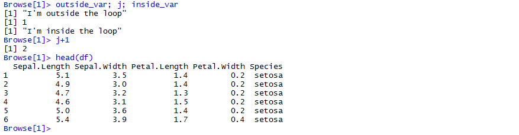

## What can I do in `browser()` mode?
- Type `help` for list of avaiable commands
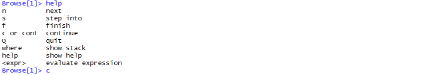

## 'c': execute all of the function
- Executes everything left (until the next `browser()` call that is)
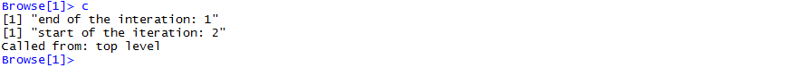
- Sanity check: has the first column of `df` been changed?
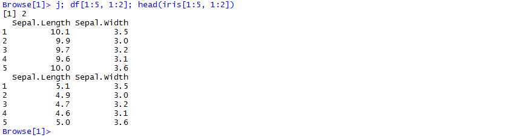

## 'n': Go to the next line
- Moves to beginning of the next line
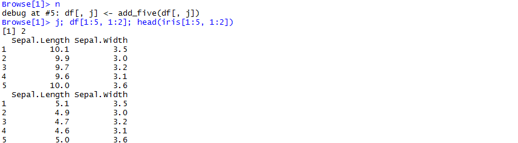
- Also executes your current line (before moving to next ine)
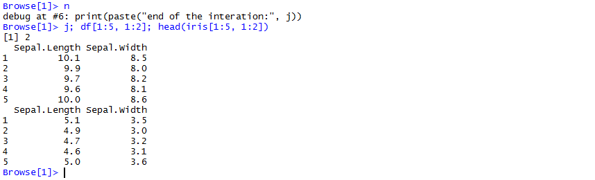

## 's': R-ception
- Go into the function call
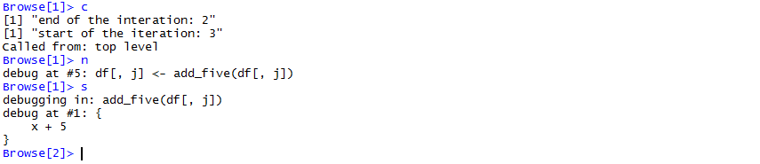

## In RStudio
- GUI supports (for function calls)
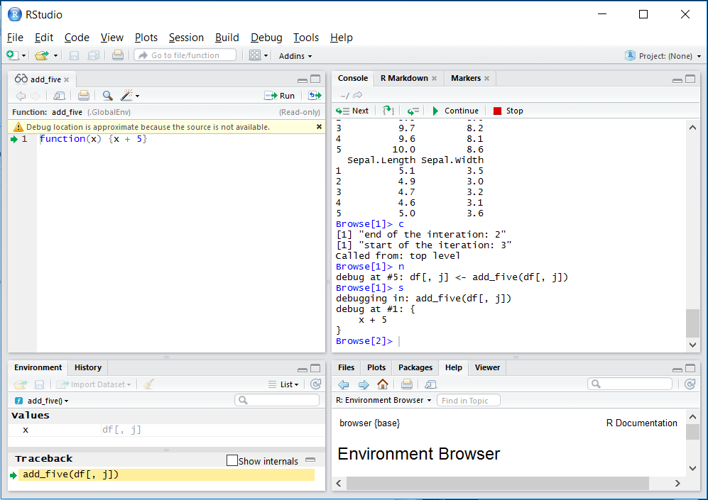

## Access everything inside the function environment
- Access variables as the function sees it
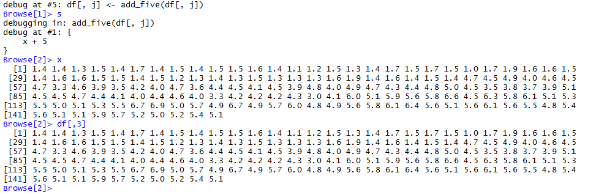

## Effectively use browser() : #1
```{r use_case_1, eval=FALSE, echo=TRUE}
add_five <- function(x) {x + 5}
df <- iris
for(j in 1:ncol(df)){
  if(j == 5) {
    browser()
  }
  df[,j] <- add_five(df[,j])
}
```

## Effectively use browser() : #2
```{r use_case_2, eval=FALSE, echo=TRUE}
library(dplyr)
df <- iris
df %>%
  group_by(Species) %>%
  mutate(avg_sepal_length = 
           list(Species = Species, Sepal.Length = Sepal.Length) %>% 
           browser()
  )
```

## Look at individual group
- Pass data to `browser()`
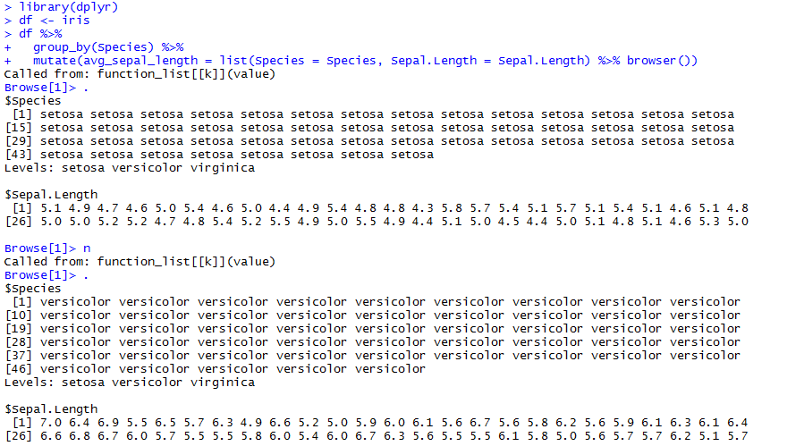

## Other resources
- `debug()`, `trace()`